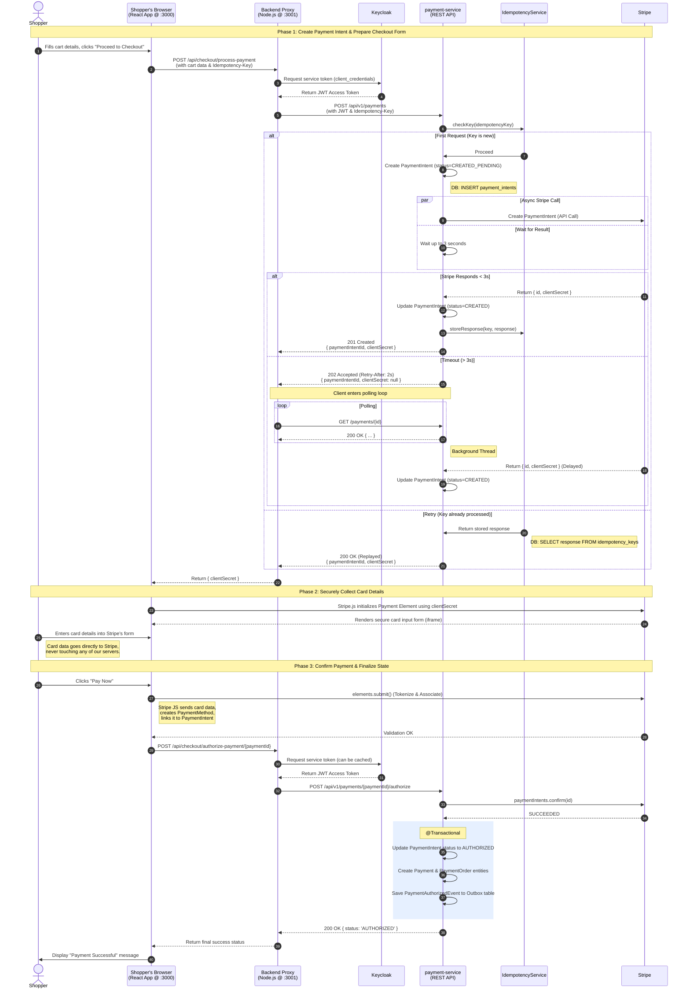
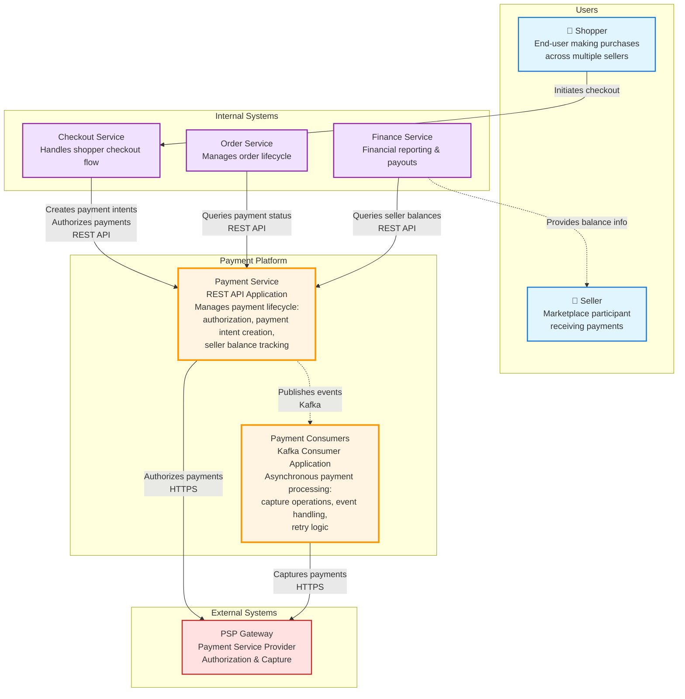
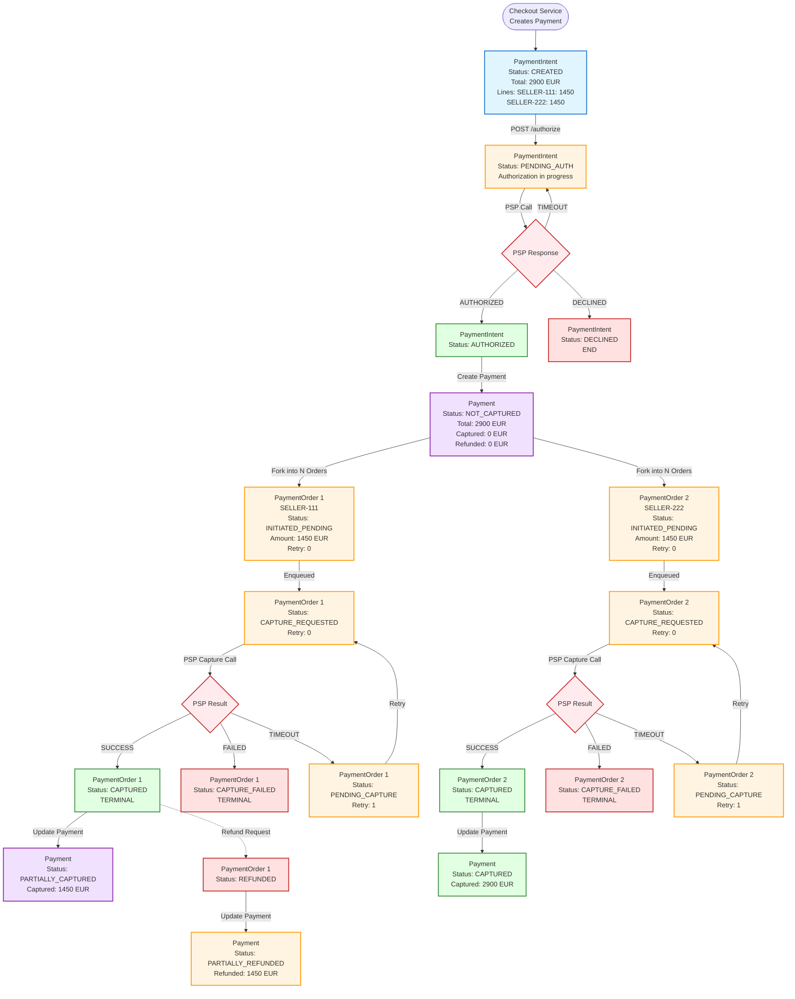

Authorization Flow(Sync. Idempotent,low latency)

```mermaid
sequenceDiagram
    autonumber

    actor Shopper

    participant Browser as Shopper's Browser<br/>(React App @ :3000)
    participant Proxy as Backend Proxy<br/>(Node.js @ :3001)
    participant Keycloak
    participant PaymentSvc as payment-service<br/>(REST API)
    participant IdemSvc as IdempotencyService
    participant Stripe

    %% Step 1: Create Payment Intent
    Note over Shopper, Stripe: Phase 1: Create Payment Intent & Prepare Checkout Form

    Shopper->>Browser: Fills cart details, clicks "Proceed to Checkout"
    Browser->>Proxy: POST /api/checkout/process-payment<br/>(with cart data & Idempotency-Key)
    
    Proxy->>Keycloak: Request service token (client_credentials)
    Keycloak-->>Proxy: Return JWT Access Token

    Proxy->>PaymentSvc: POST /api/v1/payments<br/>(with JWT & Idempotency-Key)
    
    %% --- IDEMPOTENCY FLOW ---
    PaymentSvc->>IdemSvc: checkKey(idempotencyKey)
    alt First Request (Key is new)
        IdemSvc->>PaymentSvc: Proceed
        PaymentSvc->>PaymentSvc: Create PaymentIntent (status=CREATED_PENDING)
        note right of PaymentSvc: DB: INSERT payment_intents
        
        par Async Stripe Call
            PaymentSvc->>Stripe: Create PaymentIntent (API Call)
        and Wait for Result
            PaymentSvc->>PaymentSvc: Wait up to 3 seconds
        end

        alt Stripe Responds < 3s
            Stripe-->>PaymentSvc: Return { id, clientSecret }
            PaymentSvc->>PaymentSvc: Update PaymentIntent (status=CREATED)
            PaymentSvc->>IdemSvc: storeResponse(key, response)
            PaymentSvc-->>Proxy: 201 Created<br/>{ paymentIntentId, clientSecret }
        else Timeout (> 3s)
            PaymentSvc-->>Proxy: 202 Accepted (Retry-After: 2s)<br/>{ paymentIntentId, clientSecret: null }
            
            Note over Proxy, PaymentSvc: Client enters polling loop
            
            loop Polling
                Proxy->>PaymentSvc: GET /payments/{id}
                PaymentSvc-->>Proxy: 200 OK { ... }
            end

            Note right of PaymentSvc: Background Thread
            Stripe-->>PaymentSvc: Return { id, clientSecret } (Delayed)
            PaymentSvc->>PaymentSvc: Update PaymentIntent (status=CREATED)
        end

    else Retry (Key already processed)
        IdemSvc->>PaymentSvc: Return stored response
        note right of IdemSvc: DB: SELECT response FROM idempotency_keys
        PaymentSvc-->>Proxy: 200 OK (Replayed)<br/>{ paymentIntentId, clientSecret }
    end
    %% --- END IDEMPOTENCY FLOW ---

    Proxy-->>Browser: Return { clientSecret }

    %% Step 2: Collect Card Details via Stripe Element
    Note over Shopper, Stripe: Phase 2: Securely Collect Card Details

    Browser->>Stripe: Stripe.js initializes Payment Element using clientSecret
    Stripe-->>Browser: Renders secure card input form (iframe)
    
    Shopper->>Browser: Enters card details into Stripe's form
    Note right of Shopper: Card data goes directly to Stripe,<br/>never touching any of our servers.

    %% Step 3: Confirm Payment with Stripe and Authorize Internally
    Note over Shopper, Stripe: Phase 3: Confirm Payment & Finalize State

    Shopper->>Browser: Clicks "Pay Now"
    Browser->>Stripe: elements.submit() (Tokenize & Associate)
    Note right of Browser: Stripe JS sends card data,<br/>creates PaymentMethod,<br/>links it to PaymentIntent
    Stripe-->>Browser: Validation OK
    Browser->>Proxy: POST /api/checkout/authorize-payment/{paymentId}
    
    Proxy->>Keycloak: Request service token (can be cached)
    Keycloak-->>Proxy: Return JWT Access Token

    Proxy->>PaymentSvc: POST /api/v1/payments/{paymentId}/authorize
    
    PaymentSvc->>Stripe: paymentIntents.confirm(id)
    Stripe-->>PaymentSvc: SUCCEEDED

    rect rgb(230, 240, 255)
        note over PaymentSvc: @Transactional
        PaymentSvc->>PaymentSvc: Update PaymentIntent status to AUTHORIZED
        PaymentSvc->>PaymentSvc: Create Payment & PaymentOrder entities
        PaymentSvc->>PaymentSvc: Save PaymentAuthorizedEvent to Outbox table
    end

    PaymentSvc-->>Proxy: 200 OK { status: 'AUTHORIZED' }
    Proxy-->>Browser: Return final success status
    Browser->>Shopper: Display "Payment Successful" message
```

```mermaid
graph TB
    subgraph "Users"
        Shopper[👤 Shopper<br/>End-user making purchases<br/>across multiple sellers]
        Seller[👤 Seller<br/>Marketplace participant<br/>receiving payments]
    end

    subgraph "Internal Systems"
        CheckoutService[Checkout Service<br/>Handles shopper checkout flow]
        OrderService[Order Service<br/>Manages order lifecycle]
        FinanceService[Finance Service<br/>Financial reporting & payouts]
    end

    subgraph "Payment Platform"
        PaymentService[Payment Service<br/>REST API Application<br/>Manages payment lifecycle:<br/>authorization, payment intent creation,<br/>seller balance tracking]
        PaymentConsumers[Payment Consumers<br/>Kafka Consumer Application<br/>Asynchronous payment processing:<br/>capture operations, event handling,<br/>retry logic]
    end

    subgraph "External Systems"
        PSPGateway[PSP Gateway<br/>Payment Service Provider<br/>Authorization & Capture]
    end

    %% User interactions
    Shopper -->|Initiates checkout| CheckoutService
    
    %% Internal system interactions
    CheckoutService -->|Creates payment intents<br/>Authorizes payments<br/>REST API| PaymentService
    OrderService -->|Queries payment status<br/>REST API| PaymentService
    FinanceService -->|Queries seller balances<br/>REST API| PaymentService
    
    %% Payment Platform internal interactions
    PaymentService -.->|Publishes events<br/>Kafka| PaymentConsumers
    
    %% External system interactions
    PaymentService -->|Authorizes payments<br/>HTTPS| PSPGateway
    PaymentConsumers -->|Captures payments<br/>HTTPS| PSPGateway
    
    %% Indirect user interactions
    FinanceService -.->|Provides balance info| Seller

    %% Styling
    style Shopper fill:#e1f5ff,stroke:#1976D2,stroke-width:2px
    style Seller fill:#e1f5ff,stroke:#1976D2,stroke-width:2px
    style PaymentService fill:#fff4e1,stroke:#FF9800,stroke-width:3px
    style PaymentConsumers fill:#fff4e1,stroke:#FF9800,stroke-width:3px
    style CheckoutService fill:#f0e1ff,stroke:#8E24AA,stroke-width:2px
    style OrderService fill:#f0e1ff,stroke:#8E24AA,stroke-width:2px
    style FinanceService fill:#f0e1ff,stroke:#8E24AA,stroke-width:2px
    style PSPGateway fill:#ffe1e1,stroke:#C62828,stroke-width:2px
```

```mermaid
graph TD
    Start([Checkout Service<br/>Creates Payment]) --> PI1[PaymentIntent<br/>Status: CREATED<br/>Total: 2900 EUR<br/>Lines: SELLER-111: 1450<br/>SELLER-222: 1450]

    PI1 -->|POST /authorize| PI2[PaymentIntent<br/>Status: PENDING_AUTH<br/>Authorization in progress]

    PI2 -->|PSP Call| PSP{PSP Response}
    
    PSP -->|AUTHORIZED| PI3[PaymentIntent<br/>Status: AUTHORIZED]
    PSP -->|DECLINED| PI4[PaymentIntent<br/>Status: DECLINED<br/>END]
    PSP -->|TIMEOUT| PI2

    PI3 -->|Create Payment| P1[Payment<br/>Status: NOT_CAPTURED<br/>Total: 2900 EUR<br/>Captured: 0 EUR<br/>Refunded: 0 EUR]

    P1 -->|Fork into N Orders| PO1[PaymentOrder 1<br/>SELLER-111<br/>Status: INITIATED_PENDING<br/>Amount: 1450 EUR<br/>Retry: 0]
    P1 -->|Fork into N Orders| PO2[PaymentOrder 2<br/>SELLER-222<br/>Status: INITIATED_PENDING<br/>Amount: 1450 EUR<br/>Retry: 0]

    %% PaymentOrder 1 State Machine
    PO1 -->|Enqueued| PO1A[PaymentOrder 1<br/>Status: CAPTURE_REQUESTED<br/>Retry: 0]
    PO1A -->|PSP Capture Call| PSP1{PSP Result}
    PSP1 -->|SUCCESS| PO1B[PaymentOrder 1<br/>Status: CAPTURED<br/>TERMINAL]
    PSP1 -->|FAILED| PO1C[PaymentOrder 1<br/>Status: CAPTURE_FAILED<br/>TERMINAL]
    PSP1 -->|TIMEOUT| PO1D[PaymentOrder 1<br/>Status: PENDING_CAPTURE<br/>Retry: 1]
    PO1D -->|Retry| PO1A

    %% PaymentOrder 2 State Machine
    PO2 -->|Enqueued| PO2A[PaymentOrder 2<br/>Status: CAPTURE_REQUESTED<br/>Retry: 0]
    PO2A -->|PSP Capture Call| PSP2{PSP Result}
    PSP2 -->|SUCCESS| PO2B[PaymentOrder 2<br/>Status: CAPTURED<br/>TERMINAL]
    PSP2 -->|FAILED| PO2C[PaymentOrder 2<br/>Status: CAPTURE_FAILED<br/>TERMINAL]
    PSP2 -->|TIMEOUT| PO2D[PaymentOrder 2<br/>Status: PENDING_CAPTURE<br/>Retry: 1]
    PO2D -->|Retry| PO2A

    %% Payment Status Updates
    PO1B -->|Update Payment| P2[Payment<br/>Status: PARTIALLY_CAPTURED<br/>Captured: 1450 EUR]
    PO2B -->|Update Payment| P3[Payment<br/>Status: CAPTURED<br/>Captured: 2900 EUR]

    %% Refund Flow (optional)
    PO1B -.->|Refund Request| PO1E[PaymentOrder 1<br/>Status: REFUNDED]
    PO1E -->|Update Payment| P4[Payment<br/>Status: PARTIALLY_REFUNDED<br/>Refunded: 1450 EUR]

    %% Styling
    style PI1 fill:#e1f5ff,stroke:#1976D2,stroke-width:2px
    style PI2 fill:#fff4e1,stroke:#FF9800,stroke-width:2px
    style PI3 fill:#e1ffe1,stroke:#388E3C,stroke-width:2px
    style PI4 fill:#ffe1e1,stroke:#C62828,stroke-width:2px
    style P1 fill:#f0e1ff,stroke:#8E24AA,stroke-width:2px
    style P2 fill:#f0e1ff,stroke:#8E24AA,stroke-width:2px
    style P3 fill:#e1ffe1,stroke:#388E3C,stroke-width:2px
    style P4 fill:#fff4e1,stroke:#FF9800,stroke-width:2px
    style PO1 fill:#fff4e1,stroke:#FF9800,stroke-width:2px
    style PO1A fill:#fff4e1,stroke:#FF9800,stroke-width:2px
    style PO1B fill:#e1ffe1,stroke:#388E3C,stroke-width:2px
    style PO1C fill:#ffe1e1,stroke:#C62828,stroke-width:2px
    style PO1D fill:#fff4e1,stroke:#FF9800,stroke-width:2px
    style PO1E fill:#ffe1e1,stroke:#C62828,stroke-width:2px
    style PO2 fill:#fff4e1,stroke:#FF9800,stroke-width:2px
    style PO2A fill:#fff4e1,stroke:#FF9800,stroke-width:2px
    style PO2B fill:#e1ffe1,stroke:#388E3C,stroke-width:2px
    style PO2C fill:#ffe1e1,stroke:#C62828,stroke-width:2px
    style PO2D fill:#fff4e1,stroke:#FF9800,stroke-width:2px
    style PSP fill:#ffebee,stroke:#C62828,stroke-width:2px
    style PSP1 fill:#ffebee,stroke:#C62828,stroke-width:2px
    style PSP2 fill:#ffebee,stroke:#C62828,stroke-width:2px
```
